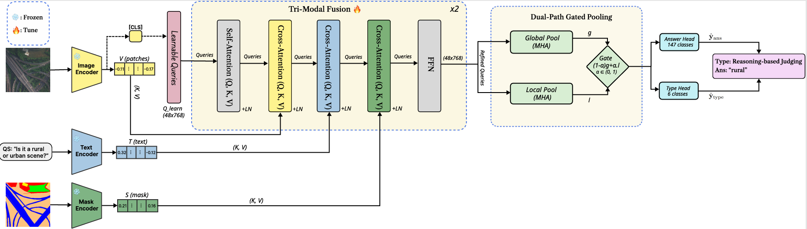

# MGQ-Former: Mask-Guided Tri-Modal Fusion Framework for Remote Sensing VQA

Official implementation of **MGQ-Former**, a mask-guided tri-modal fusion framework for Remote Sensing Visual Question Answering (RS-VQA), evaluated on the [EarthVQA](http://rsidea.whu.edu.cn/EarthVQA.htm) benchmark.

<p align="center">
  
</p>

---

## Overview

Most RS-VQA methods fuse an image and a question directly, and introduce spatial structure — when they use it at all — as an auxiliary signal attached to a conventional two-modality backbone. MGQ-Former instead treats the **semantic segmentation mask as a full third modality**, fused with visual and textual features through structurally identical cross-attention, so that spatial priors participate in every fusion layer on the same terms as the image and the question.

**Key components:**

| Component | Description |
|---|---|
| **Frozen encoders** | CLIP ViT-B/16 (visual) and RoBERTa-large (textual) remain frozen; only a linear projection is trained on the text side. |
| **Mask encoder** | A lightweight 5-layer strided CNN trained from scratch, encoding the mask into a 7×7 token grid. |
| **Tri-modal Q-Former** | 48 learnable queries, CLS-conditioned, refined over 2 fusion layers. Each layer applies self-attention followed by three identically structured cross-attention sub-layers (image, text, mask) and an FFN, each with residual + LayerNorm. |
| **Dual-path gated pooling** | Two attention-pooling paths of differing sharpness (global and temperature-sharpened local, τ = 1.5), blended by a gate conditioned on a detached question-type signal. |
| **Dual heads** | Answer classification (147 classes) and auxiliary question-type classification (6 classes), trained jointly with λ = 0.3. |

**Design goal:** competitive accuracy at substantially lower trainable-parameter cost. Because both backbones stay frozen, only the fusion stack, mask encoder, pooling module, and prediction heads are trained.

---

## Repository Structure

```
.
├── data/
│   ├── dataset.py            # Raw EarthVQA dataset loader (images, masks, QA)
│   └── dataset.ipynb
├── image_extract/
│   └── vit.ipynb             # Stage 1: precompute frozen CLIP ViT embeddings
├── text_extract/
│   └── roberta.ipynb         # Stage 1: precompute frozen RoBERTa embeddings
├── fusion/
│   ├── fusion_model.py       # MGQ-Former architecture
│   ├── fusion_dataset.py     # Dataset/dataloader over precomputed embeddings + masks
│   ├── training.py           # Training loop, evaluation, checkpointing
│   ├── main.py               # CLI entry point for training
│   ├── inference.ipynb       # Inference and qualitative visualization
│   ├── fusion.ipynb          # Development notebook
│   └── charts.ipynb          # Result plots
├── requirements.txt
└── README.md
```

---

## Installation

```bash
git clone https://github.com/Nabil0090/RS-Vamba.git
cd RS-Vamba

python -m venv .venv
source .venv/bin/activate        # Windows: .venv\Scripts\activate

pip install -r requirements.txt
```

**Environment used for the reported results:**

| | |
|---|---|
| Python | 3.11 |
| PyTorch | 2.6.0 + CUDA 12.4 |
| GPU | Single NVIDIA GPU (CUDA required for mixed-precision training) |

---

## Dataset

MGQ-Former is trained and evaluated on **EarthVQA**, which extends the LoveDA land-cover dataset with 208,593 question–answer pairs across six question types.

```python
import kagglehub
BASE = kagglehub.dataset_download(
    "alienxc137/earthvqa-semantic-segmentation-visual-question-ans"
)
```

Expected layout:

```
<BASE>/
├── 2024EarthVQA/2024EarthVQA/
│   ├── Train_QA.json
│   ├── Val_QA.json
│   └── Test_QA.json
├── Train-003/Train/
│   ├── images_png/
│   └── masks_png/
├── Val-002/Val/
│   ├── images_png/
│   └── masks_png/
└── Test-001/
    └── images_png/
```

> **Note on evaluation split.** The public EarthVQA release provides segmentation masks for the **train and validation splits only**; the test split contains images without masks. Following prior work on this benchmark (SOBA, ACR), **all reported results are on the validation split**, where ground-truth masks are available.

---

## Reproducing the Results

Training runs in two stages. Stage 1 precomputes embeddings from the frozen backbones once; Stage 2 trains the fusion model on top of them. This separation is what makes training cheap — the frozen encoders never run during the training loop.

### Stage 1 — Precompute frozen embeddings

Run both notebooks once. Each writes chunked `.pt` files that Stage 2 reads.

```bash
jupyter notebook image_extract/vit.ipynb     # → CLIP ViT-B/16 patch + CLS embeddings
jupyter notebook text_extract/roberta.ipynb  # → RoBERTa-large token + CLS embeddings
```

Set the dataset paths at the top of each notebook to match your `BASE` directory before running.

### Stage 2 — Train MGQ-Former

```bash
cd fusion

python main.py \
  --vit_emb_dir   /path/to/image_extract/outputs/vit_encoded/embeddings \
  --text_emb_dir  /path/to/text_extract/outputs/text_encoded/embeddings \
  --qa_dir        <BASE>/2024EarthVQA/2024EarthVQA \
  --train_mask_dir <BASE>/Train-003/Train/masks_png \
  --val_mask_dir   <BASE>/Val-002/Val/masks_png \
  --output_dir    ./outputs
```

All hyperparameters below default to the values used for the reported results, so the command above reproduces them without further flags.

**Model:**

| Argument | Default | Description |
|---|---|---|
| `--num_queries` | 48 | Learnable query tokens |
| `--num_layers` | 2 | Q-Former fusion layers |
| `--num_heads` | 8 | Attention heads |
| `--ffn_dim` | 3072 | FFN hidden dimension |
| `--dropout` | 0.2 | Dropout rate |

**Optimization:**

| Argument | Default | Description |
|---|---|---|
| `--batch_size` | 16 | Batch size |
| `--num_epochs` | 10 | Training epochs |
| `--warmup_epochs` | 2 | LR warmup epochs |
| `--lr_qformer` | 1e-4 | LR for the fusion stack |
| `--lr_head` | 5e-4 | LR for prediction heads |
| `--lr_mask` | 1e-4 | LR for the mask encoder |
| `--weight_decay` | 0.07 | AdamW weight decay |
| `--lambda_type` | 0.3 | Weight on the auxiliary type loss |
| `--label_smoothing` | 0.1 | Label smoothing on the answer loss |
| `--max_grad_norm` | 1.0 | Gradient clipping |

Resume an interrupted run with `--resume ./outputs/checkpoints/<checkpoint>.pt`.

### Outputs

```
outputs/
├── checkpoints/          # epoch_XX_acc_X.XXXX.pt  (top-k retained)
└── logs/
    ├── config.json       # exact configuration used
    └── history.json      # per-epoch loss, overall and per-type accuracy
```

Validation accuracy is reported both overall and per question type (Basic Counting, Basic Judging, Comprehensive Analysis, Object Situation Analysis, Reasoning-based Counting, Reasoning-based Judging) after every epoch.

---

## Inference

Open `fusion/inference.ipynb`, set the checkpoint path and dataset paths in the first cell, and run. The notebook loads a trained checkpoint and produces per-sample predictions with top-k answer probabilities alongside the input image and question.

> Inference requires a segmentation mask, since the mask is a required model input rather than an optional signal. Ground-truth masks are available for the train and validation splits. For images without a mask, one must be supplied by a segmentation model; the notebook includes an optional cell for generating pseudo-masks with a segmenter trained on the EarthVQA training masks.

---

## Citation

```bibtex
@article{mgqformer,
  title   = {MGQ-Former: Mask-Guided Tri-Modal Fusion Framework for Remote Sensing VQA},
  author  = {...},
  journal = {...},
  year    = {2026}
}
```

## Acknowledgements

Built on the [EarthVQA](http://rsidea.whu.edu.cn/EarthVQA.htm) benchmark and the LoveDA dataset. The fusion design follows the query-bottleneck principle introduced by BLIP-2.
